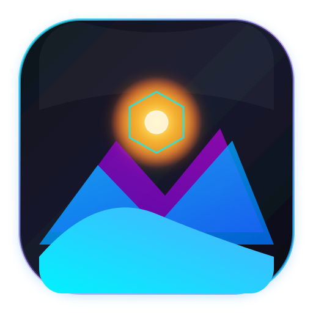

<div align="center">
  
  <h1>Vantage</h1>
  <p><strong>A Next-Generation, Ultra-Performance Native Live Wallpaper Engine for macOS 🌌</strong></p>

  <p>
    <a href="https://github.com/satiricalguru/Vantage/stargazers"></a>
    <a href="https://github.com/satiricalguru/Vantage/network/members"></a>
    <a href="https://github.com/satiricalguru/Vantage/releases"></a>
    <a href="https://github.com/satiricalguru/Vantage/blob/main/LICENSE"></a>
  </p>

  <p>
    <a href="#-key-features">Key Features</a> •
    <a href="#-technical-architecture">Architecture</a> •
    <a href="#-performance--battery-intelligence">Performance</a> •
    <a href="#-tech-stack">Tech Stack</a> •
    <a href="#-getting-started">Getting Started</a> •
    <a href="#%EF%B8%8F-building-from-source">Build Instructions</a>
  </p>
</div>

<hr />

## 🌟 Overview

**Vantage** is a free, open-source, ultra-performance native live wallpaper application engineered specifically for macOS. Built with high-efficiency streaming protocols and direct macOS Desktop level window hooks (`kCGDesktopWindowLevel`), Vantage transforms your desktop into a fluid canvas without sacrificing performance or battery life.

Whether you want crisp high-resolution video loops, interactive particle physics, AI-generated ambient wallpapers, or local imports, Vantage delivers a seamless visual experience across single and multi-monitor setups. Optional remote-source adapters are kept behind the main-process network boundary.

---

## ✨ Key Features

### 🖥️ Native Multi-Monitor Management
- **Independent Display Control**: Assign unique live wallpapers to each connected monitor or span wallpapers across your workspace.
- **Hot-Plug Awareness**: Automatically detects display connections, disconnections, and resolution changes, preserving wallpaper assignments instantly.

### ⚡ Zero-Lag Hardware Accelerated Streaming
- **Custom `media://` Protocol**: Bypasses browser memory limits by implementing custom HTTP 206 Partial Content (Range Request) streaming directly from disk.
- **4K/60FPS Smooth Playback**: Plays heavy H.264/HEVC videos and WebM loops with near-zero memory footprint and smooth hardware acceleration.

### 🔒 Native macOS Screen Saver
- **True Screen Saver module**: Vantage builds a native universal `.saver` companion using Apple’s `ScreenSaverView` and AVFoundation APIs.
- **Live video playback**: The companion reads the selected local video and loops it natively inside macOS Screen Saver.
- **Lock Screen behavior**: macOS owns the authenticated login layer. Vantage pauses its Electron desktop wallpaper while locked; the native Screen Saver is the supported path for live content before password unlock.
- **Setup**: Open Preferences → Install & Activate. Vantage installs and activates itself as the current user’s Screen Saver, then opens System Settings → Wallpaper. Test the Screen Saver first; an immediate authenticated Lock Screen can show the system wallpaper until the Screen Saver is active.

### 🔋 Battery & Energy Saver Intelligence
- **Battery Saver Mode**: Automatically reduces canvas cadence and video playback speed when running on battery power to conserve energy.


### 🌌 AI & Generative Live Canvas
- **Generative Particle Engine**: Real-time customizable particle systems with dynamic light fields and interactive cursor responses.
- **AI Still Animation**: Transforms static high-res wallpapers into lively atmospheric motion scenes with depth parallax and subtle ambient movement.
- **Configurable Render Cadence**: Choose Quality, Balanced, or Battery Saver behavior per display.

### 📂 Automatic Local Folder Watcher & Import
- **Instant Folder Import**: Simply drop `.mp4`, `.mov`, `.webm`, `.png`, `.jpg`, or `.webp` files into `~/Pictures/Vantage Wallpapers/`.
- **Drag-and-Drop Ingestion**: Import custom wallpapers straight from the gallery UI with instant preview generation.

### 🎛️ Mac-Native Dark Glass UI & Tray
- **Menu Bar Tray Application**: Control playback, change wallpapers, or tweak settings quickly from the macOS menu bar tray.
- **macOS Vibrancy & Glassmorphism**: Features macOS native `sidebar` vibrancy effects, sleek typography, and fluid Framer Motion animations.
- **Dock Hiding Option**: Run silently in the background as a menubar utility without cluttering your macOS Dock.

---

## 🏛️ Technical Architecture

Vantage is built with a dual-process architecture separating the core system service from the visual wallpaper renderers and configuration gallery:

```
                               ┌──────────────────────────────────────────┐
                               │             macOS System                 │
                               └────────────────────┬─────────────────────┘
                                                    │
                         ┌──────────────────────────┴──────────────────────────┐
                         │       Electron Main Process (System Service)        │
                         │                                                     │
                         │  • SQLite Database (better-sqlite3)                 │
                         │  • Custom media:// Protocol (HTTP 206 Range Stream) │
                         │  • Power/Battery Observer                           │
                         │  • Display Manager (Multi-Monitor IPC)              │
                         │  • Menu Bar Tray Handler                            │
                         └───────┬──────────────────────────┬──────────────────┘
                                 │                          │
           ┌─────────────────────┴──────────┐     ┌─────────┴─────────────────────┐
           │   Wallpaper Renderer Window    │     │      Gallery Window UI        │
           │  (Behind Desktop Icons)        │     │  (React 18 + Tailwind CSS)    │
           │                                │     │                               │
           │  • Video Layer (HTML5 Video)   │     │  • Wallpaper Discovery        │
           │  • AI Particle Canvas Layer    │     │  • Category & Search Filters  │
           │  • Frameless Desktop Attachment│     │  • Multi-Monitor Assignment   │
           └────────────────────────────────┘     └───────────────────────────────┘
```

---

## ⚡ Performance & Battery Intelligence

Vantage offers 3 distinct performance tiers to balance visuals with energy efficiency:

| Performance Mode | Frame Rate | Recommended Use Case |
| :--- | :--- | :--- |
| **🚀 Quality** | Up to 60 FPS canvas cadence | Dedicated GPU setups, plugged-in power workstations |
| **⚖️ Balanced** | Up to 30 FPS canvas cadence | Standard daily usage with lower energy use |
| **🌱 Battery Saver** | Up to 15 FPS canvas cadence | Maximum canvas energy conservation on MacBook battery |

---

## 🛠️ Tech Stack

| Component | Technology | Description |
| :--- | :--- | :--- |
| **Framework** | [Electron 43](https://www.electronjs.org/) | macOS desktop application runtime |
| **Frontend Framework** | [React 18](https://react.dev/) | Modern component-based UI library |
| **Language** | [TypeScript 5.7](https://www.typescriptlang.org/) | Type-safe programming language |
| **Styling & Motion** | [Tailwind CSS](https://tailwindcss.com/) & [Framer Motion](https://www.framer.com/motion/) | Utility-first CSS & fluid animation library |
| **Build System** | [Vite 7](https://vitejs.dev/) (`electron-vite`) | Lightning-fast module bundler & dev server |
| **Database** | [SQLite](https://github.com/WiseLibs/better-sqlite3) (`better-sqlite3`) | High-speed local database storage |
| **Icons** | [Lucide React](https://lucide.dev/) | Beautiful & consistent open-source icon suite |

---

## 🚀 Getting Started

### Prerequisites

- **Operating System**: macOS 12.0 (Monterey) or later (Apple Silicon M1/M2/M3/M4 & Intel x86_64)
- **Node.js**: `v18.0.0` or higher
- **Package Manager**: `npm` v9+ or `yarn` / `pnpm`

### Installation

1. Download the latest `.dmg` release from the [Releases](https://github.com/satiricalguru/Vantage/releases) page.
2. Open the downloaded `Vantage-1.0.0.dmg` file.
3. Drag **Vantage** into your `Applications` folder.
4. Launch Vantage and enjoy live wallpapers!

---

## 🛠️ Building from Source

To build and run Vantage locally on your machine:

```bash
# 1. Clone the repository
git clone https://github.com/satiricalguru/Vantage.git
cd Vantage

# 2. Install dependencies
npm install

# 3. Start the development server
npm run dev

# 4. Package the application for testing
npm run pack

# 5. Build production macOS DMG bundle
npm run dist
```

---

## 📂 Folder Structure

```
Vantage/
├── assets/                  # App branding assets & SVG icons
├── resources/               # Tray icons & built-in wallpaper thumbnails
├── src/
│   ├── main/                # Electron main process (DB, IPC, Tray, Power Manager)
│   │   ├── index.ts         # Application entrypoint & protocol registration
│   │   ├── db.ts            # SQLite database initialization & query helpers
│   │   ├── powerManager.ts  # Battery status & low power mode observer
│   │   ├── tray.ts          # macOS native menu bar tray setup
│   │   └── wallpaperWindow.ts # Window creation & desktop attachment hooks
│   ├── preload/             # Electron preload scripts & context bridges
│   └── renderer/            # React renderer application
│       ├── gallery/         # Main gallery window (Discovery, Settings, Detail)
│       └── wallpaper/       # Wallpaper layer renderers (Video, Generative, AI Still)
├── electron.vite.config.ts  # Vite build configuration
├── tailwind.config.js       # Tailwind CSS design system tokens
└── package.json             # Dependencies and build scripts
```

---

## 📄 License

Distributed under the MIT License. See [`LICENSE`](LICENSE) for more details.

<div align="center">
  <sub>Built with ❤️ for macOS power users by the Vantage Team.</sub>
</div>
